# SQL Playground

Secure SQL Playground for learning and testing SQL.

## Features

- Secure because it runs on your browser, not sending data to server
- Supports SQLite
- Default data for testing

## Default Data

```mermaid
erDiagram
    users {
        int user_id
        string username
        string timezone_id
        date created_at
    }
    timezones {
        int timezone_id
        string abbreviation
        float offset_hours
    }
    articles {
        int article_id
        string title
        string body
        int user_id
        date created_at
    }
    comments {
        int comment_id
        string body
        int user_id
        int article_id
        date created_at
    }
    users }o--|| timezones : ""
    users ||--o{ articles : ""
    users ||--o{ comments : ""
    articles ||--o{ comments : ""
```

